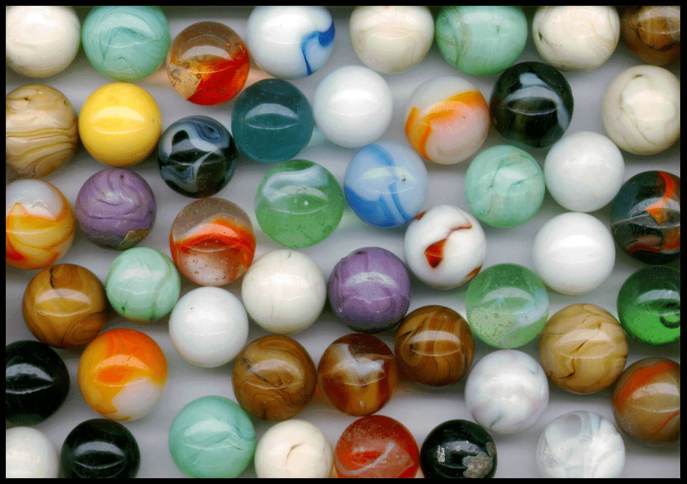

# File test directory

In this directory, you can see test file and result after passing them into compressor.
## Test pour la compression du format JPG

<table>
	<tr>
		<td style="display: flex;flex-flow: column;">
			<h3>Avant la compression:</h3>
			
			<p><b>Fichier: </b>jpg_test.jpg</p>
			<p><b>Taille: </b>4 524 Ko</p>
		</td>
		<td style="display: flex;flex-flow: column;">
			<h3>Après la compression:</h3>
			
			<p><b>Fichier: </b>jpg_result.jpg</p>
			<p><b>Taille: </b>349 Ko</p>
		</td>
	</tr>
</table>

## Test pour la compression du format PNG

<table>
	<tr>
		<td style="display: flex;flex-flow: column;">
			<h3>Avant la compression:</h3>
			
			<p><b>Fichier: </b>png_test.png</p>
			<p><b>Taille: </b>8 215 Ko</p>
		</td>
		<td style="display: flex;flex-flow: column;">
			<h3>Après la compression:</h3>
			
			<p><b>Fichier: </b>png_result.jpg</p>
			<p><b>Taille: </b>422 Ko</p>
		</td>
	</tr>
</table>

## Test pour la compression du format BMP

<table>
	<tr>
		<td style="display: flex;flex-flow: column;">
			<h3>Avant la compression:</h3>
			
			<p><b>Fichier: </b>bmp_test.bmp</p>
			<p><b>Taille: </b>4 165 Ko</p>
		</td>
		<td style="display: flex;flex-flow: column;">
			<h3>Après la compression:</h3>
			
			<p><b>Fichier: </b>bmp_result.jpg</p>
			<p><b>Taille: </b>173 Ko</p>
		</td>
	</tr>
</table>

## Test pour la compression du format GIF

<table>
	<tr>
		<td style="display: flex;flex-flow: column;">
			<h3>Avant la compression:</h3>
			
			<p><b>Fichier: </b>gif_test.gif</p>
			<p><b>Taille: </b>753 Ko</p>
		</td>
		<td style="display: flex;flex-flow: column;">
			<h3>Après la compression:</h3>
			
			<p><b>Fichier: </b>gif_result.jpg</p>
			<p><b>Taille: </b>245 Ko</p>
		</td>
	</tr>
</table>

```
Le  est ici de 
```

## Test pour la compression du format ICO

<table>
	<tr>
		<td style="display: flex;flex-flow: column;">
			<h3>Avant la compression:</h3>
			
			<p><b>Fichier: </b>ico_test.ico</p>
			<p><b>Taille: </b>244 Ko</p>
		</td>
		<td style="display: flex;flex-flow: column;">
			<h3>Après la compression:</h3>
			
			<p><b>Fichier: </b>ico_result.jpg</p>
			<p><b>Taille: </b>11 Ko</p>
		</td>
	</tr>
</table>

## Faire vos propres test

If you want to make your own test you can go throw the following list after link to download some picture.

- png:  http://www.fileformat.info/format/png/sample/index.htm
- bmp:  http://www.fileformat.info/format/bmp/sample/index.htm
- tiff: http://www.fileformat.info/format/tiff/sample/
- psd:  https://www.freepik.com/free-psd
- raw:  http://www.red.com/sample-r3d-files
- gif:  http://www.fileformat.info/format/gif/sample/index.htm
- ico:  http://www.iconarchive.com/tag/ico-files
